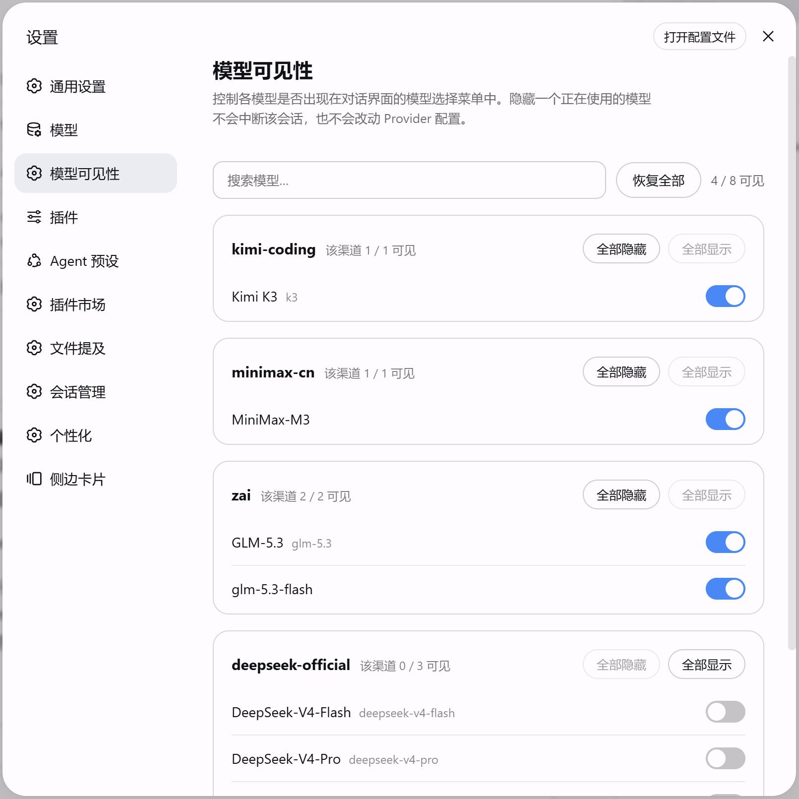

# dsh-model-visibility

**English · [中文](README.md)**

Model visibility for [DeepSeek Harness](https://github.com/deepseek-ai/deepseek-harness): control which models appear in the conversation model selector.

Installs a dedicated **Model visibility** settings section (right after 模型 / Models in the left nav):

- 🔍 **Search** — live filter by model name / id / provider
- 🎚️ **Per-model switches** — hide a model and it disappears from the selector instantly; flip back to restore
- 📦 **Provider-level batch** — hide or show every model of one provider in one click
- ♻️ **Reset all** — clear the hidden list
- 🛡️ **Zero intrusion** — writes only the plugin's own hidden list, never your provider config; hiding a model a session already uses never interrupts that session
- 🆕 **New models visible by default** — the plugin remembers what to hide, not what to show

## Preview



## Requirements

- DeepSeek Harness ≥ 0.1.1-rc.2 (earlier versions untested)
- Node.js 22+

## Install

```sh
dsh plugin --profile web add dsh-model-visibility
```

Restart `dsh web` to activate.

## How it works

- **Host half** (`lib/index.js`): owns the `model-visibility` settings section (the hidden list) and wraps `ctx.llm.listModels` at its source, so both `session.models` (the conversation selector) and `llm.models` (the settings page) receive the filtered catalog. Catalog membership is advisory in the harness, so hiding a model a session already uses never breaks that session's dispatch.
- **Browser half** (`lib/client.js`): registers a `settings.section` page; page state is the union of the filtered catalog and the hidden entries, each hidden entry labeled by the display-name snapshot captured when it was hidden.

## Uninstall

```sh
dsh plugin --profile web remove dsh-model-visibility
```

Uninstalling restores everything: the plugin never writes provider config, and the hidden list dies with the package.

## License

MIT
